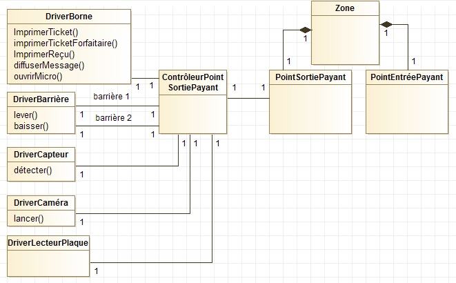

Annexe - Documentation technique
================================

:Type: Documentation technique
:Organisateur: ABI
:Auteur: CDS
:Objectif: Documenter le fonctionnement logiciel des matériels de contrôle d'accès

Ce document présente l'installation et le fonctionnement des drivers et contrôleurs de matériels de contrôle d'accès pour un point de passage

#. **DRIVERS DES MATERIELS DE CONTROLE D’ACCES**
#. #########
#. Les matériels de contrôle d'accès sont fournis par Z-Park avec des drivers dont l'API est composée des opérations essentielles suivantes
#. **Borne à ticket**
#. -- ``imprimerTicket(z chaîne, n entier)``. Imprime et sort un ticket de parking de numéro n indiquant une entrée dans la zone z à l'heure et la date courante.
#. -- imprimerTicketForfaitaire(). Imprime et sort un ticket de parking forfaitaire.
#. -- imprimerReçuCB(). Imprime et sort un reçu de carte bancaire.
#. -- affichertexte(m message). Affiche le message textuel sur l'afficheur.
#. -- diffuserAudio(m message). Diffuse le message audio m sur les hauts-parleurs.
#. -- ouvrirMicro(). Ouvre le micro.
#. **Barrière**
#. -- lever() : chaîne. Lève la barrière. Renvoie KO en cas d'échec (impossible de lever la barrière), OK sinon 
#. -- baisser() : chaîne. Baisse la barrière. Renvoie KO en cas d'échec (impossible de baisser la barrière), OK sinon
#. **Capteur de passage**
#. -- détecter(t temps) : chaîne. Détecte le passage d'un un véhicule entre le lancement de l'opération et le temps t (en secondes). Renvoie KO si aucun véhicule n'a été détecté dans l'intervalle de temps; OK sinon.
#. **Caméra de surveillance**
#. -- lancer() : chaîne. Lance la diffusion de la caméra. Renvoie un lien vers le flux vidéo si la caméra fonctionne, KO sinon.
#. #########
#. **Tous les matériels**
#. -- DriverMatériel(port entier, refContrôleur Contrôleur). Crée et lance une instance du driver avec
#.   \- port : le numéro du port de connexion au panneau de brassage du matériel
#.   \- refContrôleur la référence (un oid) du contrôleur de matériel qui va le commander
#. Ce constructeur générique a des sous-opérations pour chacun des types de matériels, par exemple DriverBarrière(port entier, refContrôleur Contrôleur) pour les barrières.
#. #########
#. Des opérations sont spécifiques à chaque type de matériel
#. #########

#. **ARCHITECTURE ET PRINCIPE DE FONCTIONNEMENT**
#. #########
#. Le système suit le patron ECB (Entity-Control-Boundary, Métier-Contrôle-IHM en français)
#. Selon ce patron, l'objet d'IHM et l'objet de contrôle se connaissent mutuellement, l'objet domaine et l'objet de contrôle se connaissent mutuellement, mais l'objet d'IHM et l'objet métier ne se connaissent pas et ne communiquent pas entre eux.
#. Ainsi pour un point de passage (entrée ou sortie) le système utilise trois objets : un objet métier (Entity), un objet de contrôle (Control) et un objet d'IHM (Boundary).
#. l'objet métier appartient à la classe PointEntree ou PointSortie selon le cas. Il est persistant sur le serveur applicatif.
#. L'objet de contrôle est un contrôleur de passage, de classe ControleurEntree ou ControleurSortie, selon le cas.
#. Il n'y pas dans ce cas un objet d'IHM mais plusieurs, car le point de passage n'a pas d'existence propre mais est composé de matériels d'accès (barrière(s), borne à tickets, ...). C'est l'ensemble des drivers de ces matériels d'accès qui constituent l'objet d'IHM, comme présenté dans le diagramme de classes de la figure 1 pour le cas de points de sortie payants.

        Fig. 1 : Diagramme de classe des drivers de matériels et des points de passage 

#. **INSTALLATION DES MATERIELS POUR UN POINT DE PASSAGE**
#. ######
#. L'installation d'un point de passage crée une instance de point de passage (dans la classe PointEntree ou PointSortie selon le cas) et une instance de contrôleur de point de passage en les liant entre elles (voir diagramme de classe).
#. Ensuite, pour chaque matériel du point de passage
#. -- le matériel est connecté physiquement au panneau de brassage du serveur de contrôle
#. -- le code du driver de matériel est installé sur le serveur de contrôle
#. -- une instance du driver de matériel est créée sur le serveur de contrôle, en lui donnant en paramètre le numéro du port de connexion au panneau de brassage et l'oid du contrôleur de point de passage qui va le commander par la suite.
#. -- la Liaison inverse est créée (du contrôleur de point de passage au matériel) 
#. -- Pour finir selon les cas
#.   \- le driver d'un borne à tickets d'un point d'entrée ou de sortie du personnel se met en attente d'un appel audio 
#.   \- le driver d'un borne à tickets d'entrée payante se met en attente d'une demande de ticket ou d'un appel audio 
#.   \- le driver d'un borne à tickets de sortie payante se met en attente d'une introduction de ticket ou d'un appel audio
#.   \- le driver des lecteurs de plaques lance la détection de plaque
#. ######

#. **FONCTIONNEMENT EN CONTINU**
#. ######

#. **Lecteur de plaque**
#. A la lecture d'une plaque, le driver de lecteur de plaque appelle l'opération contrôlerEntrée(numero entier) (ou contrôlerSortie selon le cas) de son contrôleur de point d'entrée (ou de sortie selon le cas) où numero est le numéro d'immatriculation lu. Cette opération gère l’entrée (ou la sortie selon le cas) par ce point de passage.

#. **Borne à tickets d'entrée payante**
#. A la demande de ticket, le driver de borne à tickets appelle l’opération contrôlerEntrée() de son contrôleur de point d'entrée qui va gérer l’entrée par ce point d’accès.

#. **Borne à tickets de sortie payante**
#. A la demande de ticket, le driver de borne à tickets appelle l’opération contrôlerSortie() de son contrôleur de point d'entrée qui va gérer la sortie par ce point d’accès.
#. **Toutes les borne à tickets**
#. A l'appui sur le bouton d'appel audio, le driver de borne appelle l'opération appelAudio() de son contrôleur de passage qui va gérer l'appel audio depuis ce point de passage.

#. **Borne à tickets d'entrée ou de sortie par badge**
#. A la lecture d'un badge, le driver d'une borne à tickets appelle l'opération contrôlerEntrée(code entier) (ou contrôlerSortie selon le cas) de son contrôleur d'entrée (ou de sortie selon le cas) où code est le numéro du badge lu. Cette opération gère l’entrée (ou la sortie selon le cas) par ce point de passage.

#. **Borne de paiement**
#. A la lecture d'un ticket, le driver de borne de paiement d'entrée appelle l'opération contrôlerPaiement(noTicket entier) de son contrôleur de matériel où noTicket est le numéro du ticket de stationnement lu. La méthode de cette opération va gérer le paiement par cette borne point d'accès.
